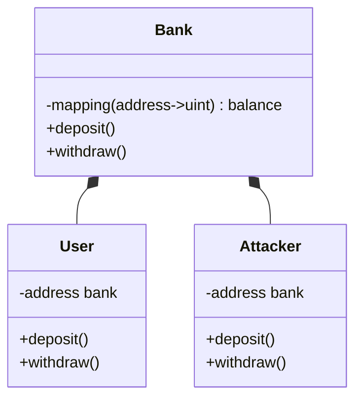
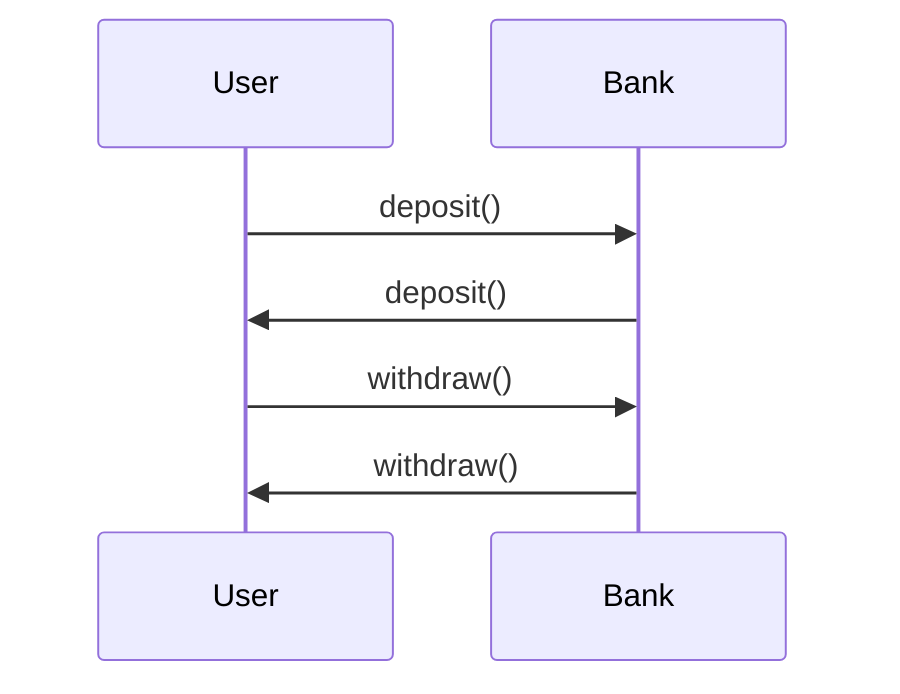
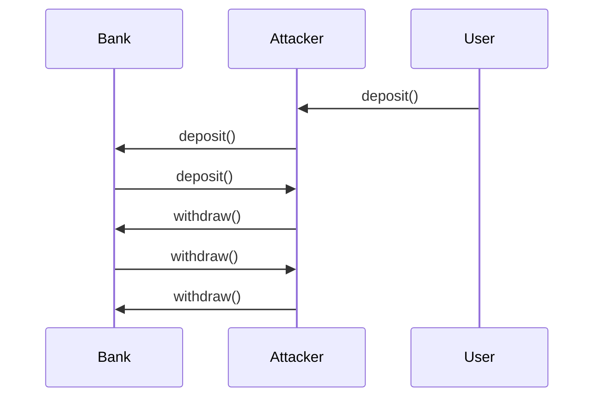
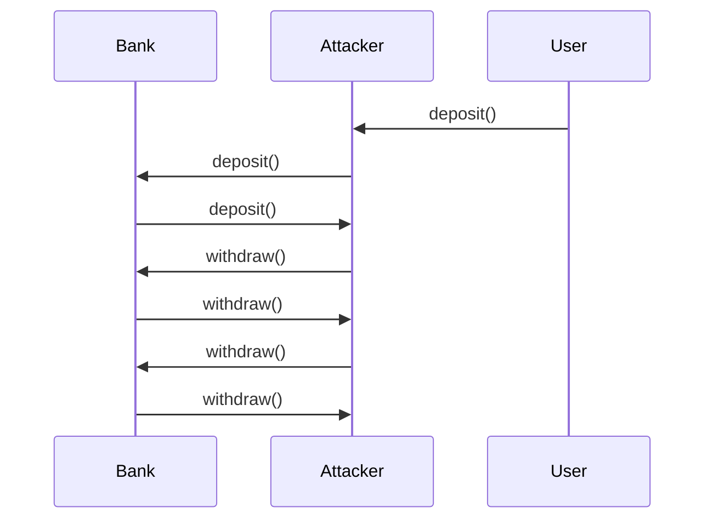

## Contract design

We design a contract with simple deposit and withdraw functions and a user contract to interact with the bank contract. on the other hand, an attacker contract is designed to attack the bank contract.




## Normal case

In the normal case, user can deposit and withdraw money from the bank contract.



## Reentrancy Attack

However in an reentrancy attack, the attacker hide its withdraw function and call the deposit function of the bank contract. The bank contract will transfer money to the attacker contract. Then the attacker contract will call the withdraw function of the bank contract to withdraw money again. The attacker contract can withdraw money from the bank contract infinitely.



## Defense

The simplest defense is a mutex lock to prevent reentrancy attack. The mutex lock is a boolean variable to indicate whether the contract is in a transaction. If the contract is in a transaction, the mutex lock is true. Otherwise, the mutex lock is false. The mutex lock is set to true at the beginning of a transaction and set to false at the end of a transaction. If the mutex lock is true, the contract will not execute the transaction.

```solidity
modifier noReentrant() {
    require(!locked, "No re-entrancy");
    locked = true;
    _;
    locked = false;
}
```

During the re-call of the withdraw function, the mutex lock will prevent the withdraw function from executing.


