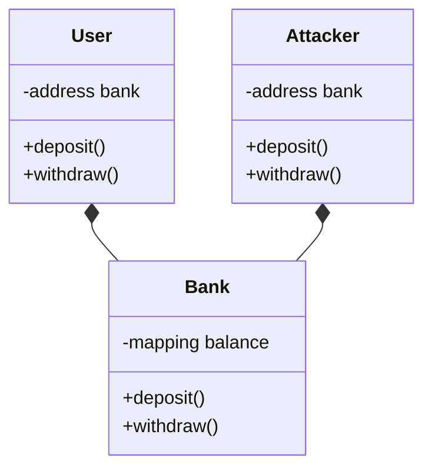
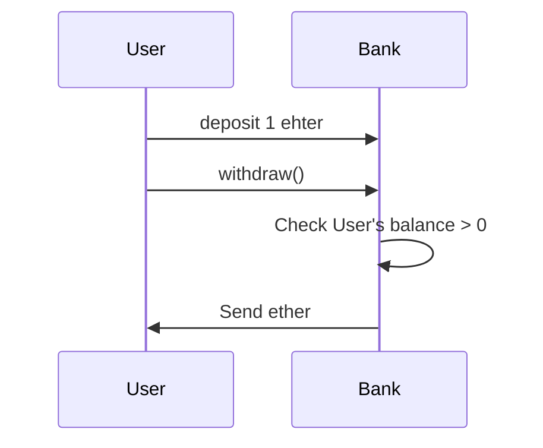
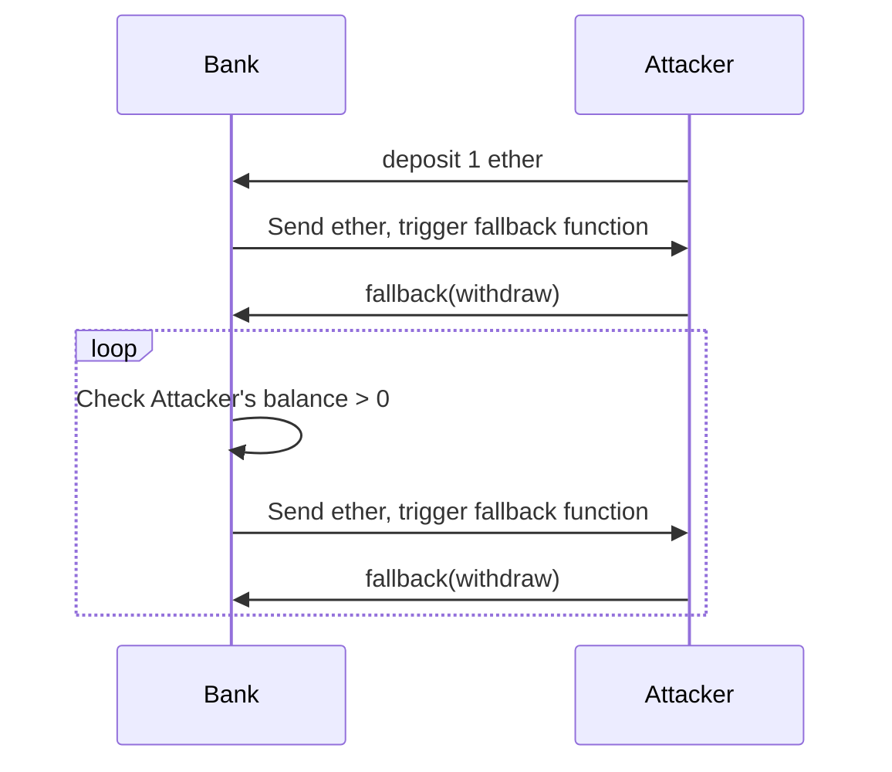
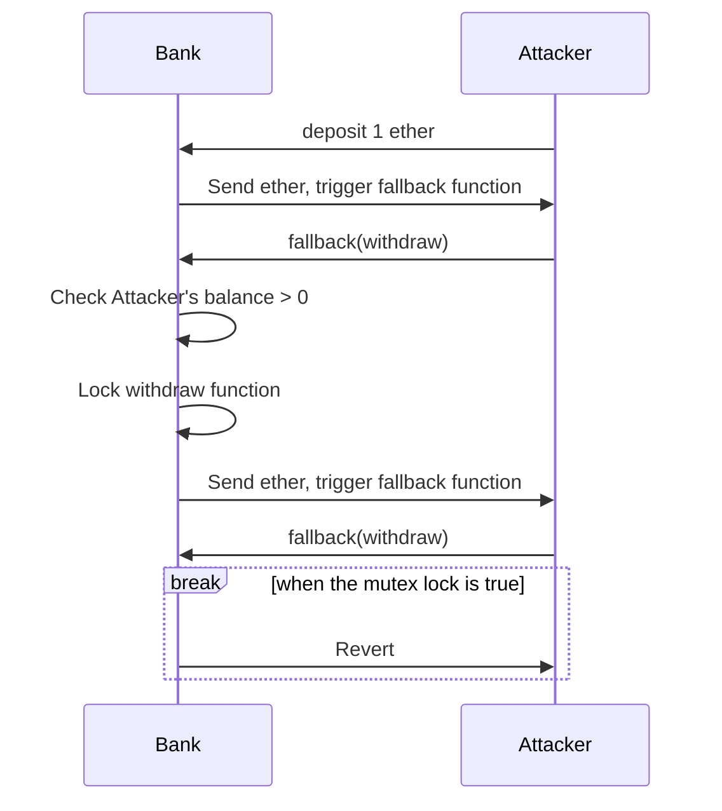
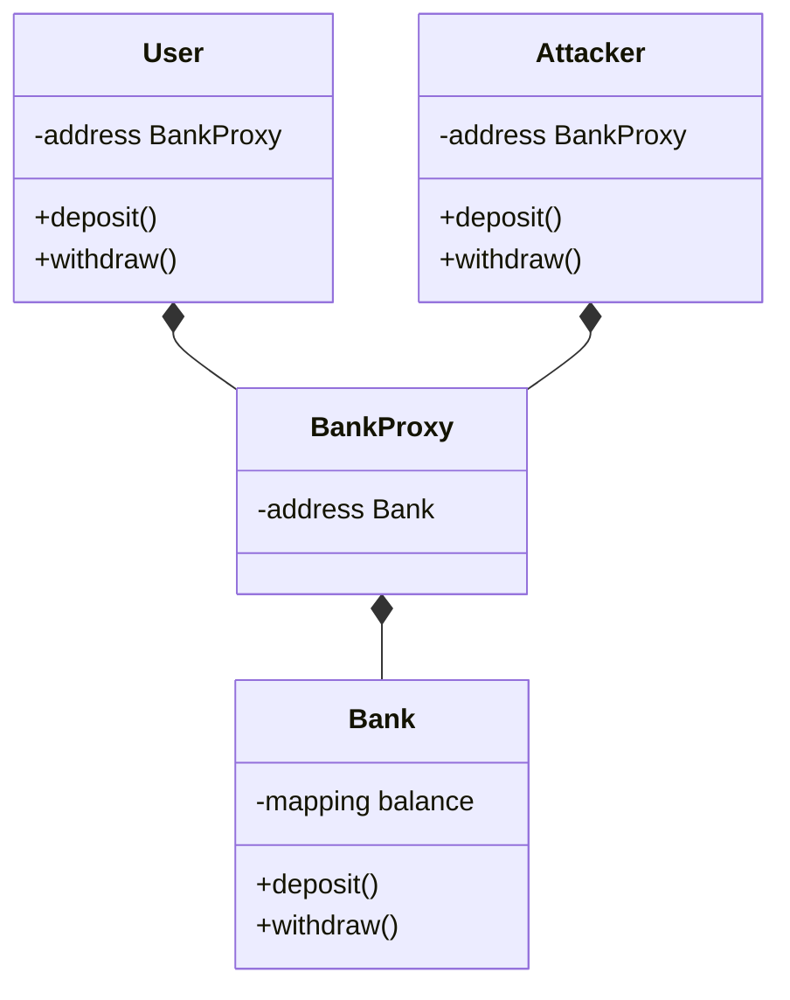
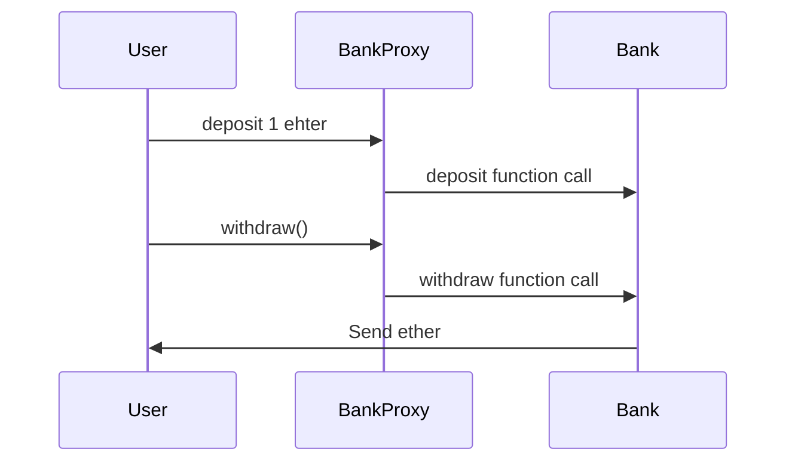
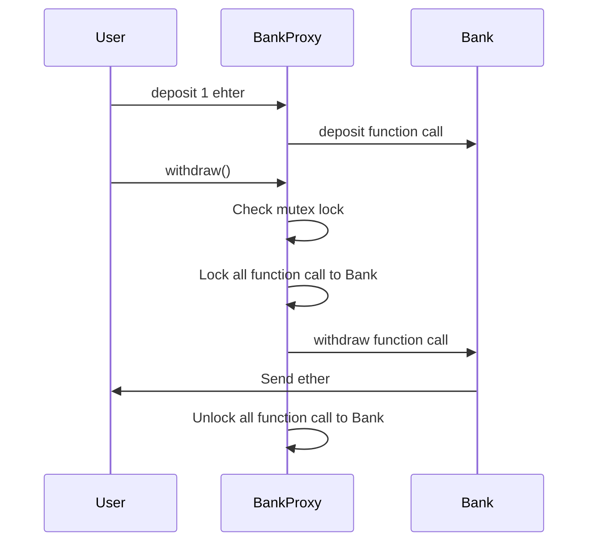

# Blockchain Project

This project is a simple bank contract with reentrancy attack and defense.
Written in Solidity and tested using Hardhat.

## Prerequisite

| Name | Version                                 |
| ---- | --------------------------------------- |
| OS   | Linux or MaxOS                          |
| Node | v16.0.0 or higher (not support v21 yet) |
| yarn | v1.22.10 or higher                      |

## Installation

Strongly recommend install all the dependencies using yarn. Npm may cause some problems.

```bash
yarn install
```

## Run the demo

We write a simple script to demonstrate the reentrancy attack and defense.

```bash
bash demo.sh
```

You can also manually run the test for each type of reentrancy guard.
Pass the guard name as an environment variable to the script or run the script directly and no guard will be used.

the available guards are [ReentrancyGuard, BalanceGuard, ProxyGuard]

- for single function reentrancy attack

```bash
REENTRANCY_GUARD=<guard> npx hardhat run scripts/singleFunctionReentrancyAttack.js
```

- for cross function reentrancy attack

```bash
REENTRANCY_GUARD=<guard> npx hardhat run scripts/crossFunctionReentrancyAttack.js
```

## Contract design

We design a contract with simple deposit and withdraw functions and a user contract to interact with the bank contract. on the other hand, an attacker contract is designed to attack the bank contract.



## Normal case

In the normal case, user can deposit and withdraw money from the bank contract.



## Reentrancy Attack

However in an reentrancy attack, the attacker hide its withdraw function and call the deposit function of the bank contract. The bank contract will transfer money to the attacker contract. Then the attacker contract will call the withdraw function of the bank contract to withdraw money again. The attacker contract can withdraw money from the bank contract infinitely.



## Defense

The simplest defense is a mutex lock to prevent reentrancy attack. The mutex lock is a boolean variable to indicate whether the contract is in a transaction. If the contract is in a transaction, the mutex lock is true. Otherwise, the mutex lock is false. The mutex lock is set to true at the beginning of a transaction and set to false at the end of a transaction. If the mutex lock is true, the contract will not execute the transaction.

```solidity
modifier noReentrant() {
    require(!locked, "No re-entrancy");
    locked = true;
    _;
    locked = false;
}
```

During the re-call of the withdraw function, the mutex lock will prevent the withdraw function from executing.



## Drawbacks of mutex lock

Since the lock is a modifier, if we have one hundred methods in the Bank, we have to add lock to all of them. It is a tedious work. Moreover, if we forget to add lock to one of the methods, the contract is still vulnerable to reentrancy attack. Therefore, we need a better solution to prevent reentrancy attack.

## Proxy contract

Proxy contract is a common design pattern in smart contract. The proxy contract is a contract that can delegate its function calls to another contract. The proxy contract is a contract that can delegate its function calls to another contract. The proxy contract has a fallback function to delegate function calls to another contract. The proxy contract can be used to upgrade the contract without changing the address of the contract. The proxy contract can also be used to prevent reentrancy attack.





So we can directly call the deposit and withdraw functions of the bank contract in the proxy contract. The proxy contract can prevent reentrancy attack by setting a mutex lock.


